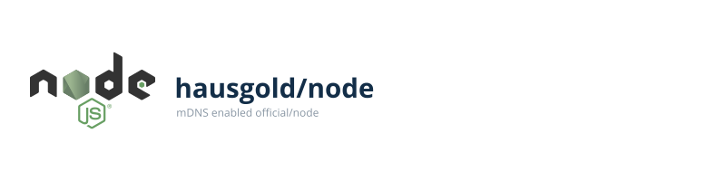

This Docker images provides the
[official/node](https://hub.docker.com/_/node/)
image as base with the mDNS/ZeroConf stack on top. So you can enjoy your
[node](https://nodejs.org/) app while it is
accessible by default as *node.local*. (Port 80)

## Requirements

* Host enabled Avahi daemon
* Host enabled mDNS NSS lookup

## Getting starting

You just need to run it like that, to get a working node:

```bash
$ docker run --rm hausgold/node
```

The port 3000 is proxied by haproxy to port 80 to make *node.local*
directly accessible. The port 3000 is untouched.

## docker-compose usage example

```yaml
node:
  image: hausgold/node
  environment:
    # Mind the .local suffix
    - MDNS_HOSTNAME=node.test.local
  ports:
    # The ports are just for you to know when configure your
    # container links, on depended containers
    - "3000"
```

## Host configs

Install the nss-mdns package, enable and start the avahi-daemon.service. Then,
edit the file /etc/nsswitch.conf and change the hosts line like this:

```bash
hosts: ... mdns4_minimal [NOTFOUND=return] resolve [!UNAVAIL=return] dns ...
```

## Configure a different mDNS hostname

The magic environment variable is *MDNS_HOSTNAME*. Just pass it like that to
your docker run command:

```bash
$ docker run --rm -e MDNS_HOSTNAME=something.else.local hausgold/node
```

This will result in *something.else.local*.

## Other top level domains

By default *.local* is the default mDNS top level domain. This images does not
force you to use it. But if you do not use the default *.local* top level
domain, you need to [configure your host avahi
configuration](https://wiki.archlinux.org/index.php/avahi#Configuring_mDNS_for_custom_TLD)
to accept it.

## Further reading

* Docker/mDNS demo: https://github.com/Jack12816/docker-mdns
* Archlinux howto: https://wiki.archlinux.org/index.php/avahi
* Ubuntu/Debian howto: https://wiki.ubuntuusers.de/Avahi/
